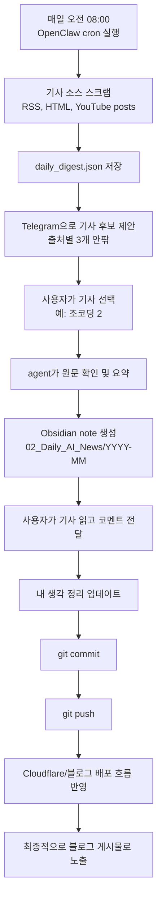

```markdown
작성 일자 : 2026-08-15
```

# AI 뉴스 기능 사용자 흐름 정리

## 개요

이 문서는 AI 뉴스 기능이 사용자의 하루 흐름 안에서 어떤 식으로 작동하는지를 중심으로 정리한 문서다.  
기술 구현 자체보다, 사용자가 Telegram에서 기사를 받고 고르고 코멘트를 남긴 뒤, 그 내용이 Obsidian과 Git, 블로그 반영까지 어떻게 이어지는지를 한눈에 보이게 하는 데 목적이 있다.

## 한눈에 보는 흐름



## 시간 순서 기준 운영 시나리오
![[Pasted image 20260815082316.png]]

### 1. 오전 08:00 기사 후보 제안

매일 오전 8시에 OpenClaw 쪽 cron이 실행되고, 로컬 Python 프로젝트가 설정된 기사 소스들을 순회하며 최신 headline을 수집한다.

- `AI News`
- `OpenAI News`
- `flex AX Hub`
- `JoCoding Posts`

이때 headline 목록은 `daily_digest.json`에 저장되고, Telegram에는 출처별로 약 3개 안팎의 기사 후보만 간단히 제안한다.  
이 단계에서는 아직 Obsidian note를 만들지 않는다.

### 2. 사용자의 선택

사용자는 Telegram에서 제목을 훑어본 뒤, `조코딩 2`, `OpenAI News 1` 같은 식으로 원하는 기사를 고른다.

이 입력은 단순 채팅 메시지이지만, 내부적으로는 아래 정보로 해석된다.

- 어떤 source를 골랐는지
- 해당 source의 몇 번째 기사인지
- `daily_digest.json` 안에서 어떤 원문 URL과 연결되는지

즉, Telegram 선택 메시지가 곧 정리 요청의 트리거가 된다.

![[Pasted image 20260815082517.png]]

### 3. 기사 정리 및 Obsidian 저장

기사를 고르면 agent가 원문을 확인하고 아래 항목을 정리한다.

- 제목
- 원문 링크
- 주요 포인트 3줄 정리
- 핵심 키워드
- 본문 발췌
- `내 생각 정리`

그 결과는 `02_Daily_AI_News/YYYY-MM/` 아래에 Markdown note로 저장된다.  
파일명은 `MM-DD - 기사 제목.md` 규칙을 따른다.

![[Pasted image 20260815082615.png]]

### 4. 사용자의 코멘트 반영

사용자가 정리된 기사 내용을 읽고 추가 의견이나 판단을 보내면, 그 내용은 note의 `내 생각 정리` 섹션으로 다시 반영된다.

예를 들어:

- 모델 성능은 좋아졌지만 답변 거부가 많다
- 악의적 질의를 더 잘 분별하는 필터가 필요하다
- 실사용 만족도는 안전장치의 정밀도에 좌우된다

이런 코멘트는 단순 대화로 흘려보내지 않고, 기사 기록 안에 남겨 이후 다시 읽을 수 있는 의견 자산으로 누적한다.

![[Pasted image 20260815082722.png]]
### 5. Git 반영과 블로그 연결

note가 정리되고 사용자의 코멘트까지 반영되면, 그 결과를 Git에 커밋하고 원격 저장소로 푸시한다.

기획상 의도는 여기서 끝나지 않는다.

- Obsidian vault 안의 기사 note가 Git 저장소에 반영되고
- 그 저장소 변경이 Cloudflare 또는 Quartz 기반 블로그 반영 흐름과 연결되며
- 최종적으로는 같은 내용이 블로그 포스트처럼 외부에 게시된다

즉, Telegram 대화에서 시작한 짧은 기사 선택이 최종적으로는 블로그 게시물 생산으로 이어지는 구조다.

## 역할별로 보면 어떻게 나뉘는가

### Telegram

- 사용자에게 가장 먼저 보이는 입구
- 아침 digest 수신
- 기사 선택
- 후속 코멘트 입력

### OpenClaw agent

- digest 읽기
- 제목 번역
- 선택값 해석
- 원문 확인
- 요약 작성
- 사용자 코멘트 반영
- 이후 Git 작업까지 이어주는 조정자

### Local Python project

- source 설정 관리
- headline 수집
- digest JSON 저장
- note template 렌더링
- 저장 경로와 파일명 규칙 관리

### Obsidian + Git + Cloudflare

- 정리 결과의 영구 저장
- 버전 관리
- 외부 게시 자동 반영 기반

## 현재 흐름과 목표 흐름

### 현재 이미 가능한 부분

- 매일 08:00 기사 후보 제안
- source별 headline 수집
- Telegram에서 기사 선택
- 선택 기사 note 생성
- 사용자 코멘트를 `내 생각 정리`에 반영

### 목표 기준으로 완성하고 싶은 부분

- 기사 선택 후 commit/push까지 한 흐름 안에서 마무리
- Git 반영 이후 Cloudflare/블로그 게시까지 더 분명한 자동 연결
- source별 본문 추출 자동화 강화
- Telegram 입력과 저장 payload의 매핑 안정화

## 이 기능이 좋은 이유

이 구조의 장점은 사용자가 긴 관리 작업을 직접 하지 않아도 된다는 점이다.

- 아침에는 후보만 빠르게 훑어본다
- 마음에 드는 기사 하나만 고른다
- 생각이 생기면 한두 줄 코멘트만 남긴다
- 나머지 정리, 저장, 기록, 게시 흐름은 agent가 이어받는다

결국 사용자의 행동은 매우 가볍지만, 남는 결과물은 Telegram 대화, Obsidian note, Git 기록, 블로그 게시물까지 연결된 긴 자산이 된다.

## 요약

이 AI 뉴스 기능은 단순 요약 봇이 아니라, `기사 추천 → 선택 → 정리 → 의견 축적 → 저장소 반영 → 블로그 게시`로 이어지는 개인 지식 생산 파이프라인으로 보는 것이 맞다.  
Telegram은 시작점이고, Obsidian은 기록지이며, Git과 Cloudflare는 외부 발행을 담당하는 후단 파이프라인이다.
